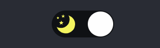

## 🍺 はじめに

ダークモードとは画面のカラーベースを暗めの色に設定する機能のことです。iPhone では ios13 のリリースより新機能として追加されています。

最近ではほとんどのアプリがダークモードに対応しているので利用したことも多いと思います。
この記事ではダークモードを React の Context API を使って実装していきます。

## 🤔 ContextAPI とは

React 公式ドキュメントによれば、コンテクストとは、

> コンテクストは各階層で手動でプロパティを下に渡すことなく、コンポーネントツリー内でデータを渡す方法を提供します。  
> ある React コンポーネントのツリーに対して「グローバル」とみなすことができる、現在の認証済みユーザー・テーマ・優先言語といったデータを共有するために設計されています。  
> [React 公式ドキュメントより コンテクスト](https://ja.reactjs.org/docs/context.html)

と書いてあります。

普段 props を通してデータの受け渡しをすることが多いと階層が深くなったり、多くのコンポーネントで使用するプロパティの受け渡しは大変です。
そこで面倒なトップダウンの props のやり取りを各コンポーネントに明示的に書くことなく、共有するためにコンテキストを使います。

## 🌙 ボタンの作成

ダークモード切り替えのボタンを先に作成します。
そこまでデザインをこだわる必要はなく、ただのボタンでもいいのですが今回は Toggle Switch を使用します。

スタイルには `styled-conponents` を使用しています。

- Switch.tsx(デザインのみ)

```typescript
import React from 'react';
import styled from 'styled-components';
// import assets
import Light from '../assets/light.svg';
import Dark from '../assets/dark.svg';

const Switch = () => {
  return (
    <ToggleSwitch>
      <DarkImg src={Dark} alt="dark-mode" />
      <LightImg src={Light} alt="light-mode" />
      <ToggleBall />
    </ToggleSwitch>
  );
};

// Switch style
const ToggleSwitch = styled.button`
  background: #0f1114;
  border: none;
  border-radius: 30px;
  cursor: pointer;
  display: flex;
  font-size: 0.5rem;
  justify-content: space-between;
  overflow: hidden;
  position: relative;
  width: 64px;
  height: 28px;
  margin: 0;
  padding: 0.5rem;

  &:focus {
    outline: none;
  }
`;

const LightImg = styled.img`
  position: absolute;
  top: 4px;
  right: 6px;
  width: 1.2rem;
  height: auto;
`;

const DarkImg = styled.img`
  position: absolute;
  top: 4px;
  left: 5px;
  width: 1.2rem;
  height: auto;
`;

const ToggleBall = styled.div`
  position: absolute;
  top: 1px;
  left: 1px;
  width: 26px;
  height: 26px;
  border-radius: 50%;
  background-color: #fefefe;
  transition: all 0.5s cubic-bezier(0.2, 1, 0.3, 1) 0ms;
`;

export default Switch;
```

---

この段階でダークモード切り替えのためのボタンが作成されます。  
このブログの右上のスイッチと一緒のものができるはずです。



## 👨‍💻 ダークモード実装

ダークモードの切り替えをするために、まず一番上のコンポーネントツリーにコンテクストの設定を行います。

### 1. テーマのスタイルを決める。

ここには好きなスタイルを記述してください。

- Theme.ts

```typescript
import { AppTheme } from '../types/type';

export const LIGHT_MODE: AppTheme = {
  text: '#353333',
  background: '#fefefe;',
};

export const DARK_MODE: AppTheme = {
  text: '#dadada',
  background: '#282c35',
};
```

### 2. コンテクストオブジェクトを作成する。

コンテクストオブジェクトを作成して、 `defaultValue` を設定します。今回はデフォルトを `light` とします。

- ThemeContext.ts

```typescript
import { createContext } from 'react';

type ThemeType = 'light' | 'dark';

const Theme: ThemeType = 'light';

export const ThemeContext = createContext<ThemeType>(Theme); // theme context
```

### 3. ツリーの上部にプロバイダを登録する。

- Layout.tsx

`styled-components` の `createGlobalStyle` を使用して、スタイルの定義をしています。

```typescript
import React, { ReactNode, useState } from 'react';
import styled, { createGlobalStyle } from 'styled-components';
// import context
import { ThemeContext } from './ThemeContext';
// import style
import { LIGHT_MODE, DARK_MODE } from '../styles/Theme';

type LayoutProps = {
  children: ReactNode;
};

type Theme = 'light' | 'dark';

const Layout = (props: LayoutProps) => {
  let localTheme: Theme;
  if (typeof localStorage !== 'undefined') {
    localTheme = window.localStorage.getItem('theme') === 'dark' ? 'dark' : 'light';
  } else {
    localTheme = 'light';
  }
  const [switchTheme, setSwitchTheme] = useState<Theme>(localTheme);

  const switchToggleThemeClick = () => {
    if (switchTheme === 'dark') {
      setSwitchTheme('light');
      localStorage.setItem('theme', 'light');
    } else {
      setSwitchTheme('dark');
      localStorage.setItem('theme', 'dark');
    }
  };

  return (
    <ThemeContext.Provider value={switchTheme}>
      <GlobalStyle theme={switchTheme} />
      // ここにコンポーネントを記入してください
    </ThemeContext.Provider>
  );
};

// Global style
const GlobalStyle = createGlobalStyle<{ theme: string }>`
  * {
    box-sizing: border-box;
  }

  html {
    overflow-y: scroll;
  }

  body {
    font-size: 16px;
    font-weight: 400;
    font-family: 'Lato';
    line-height: 1.8;
    word-wrap: break-word;
    font-kerning: normal;
    color: ${props => (props.theme === 'light' ? LIGHT_MODE.text : DARK_MODE.text)};
    background-color: ${props => (props.theme === 'light' ? LIGHT_MODE.background : DARK_MODE.background)};
  }
`;
```

ボタンの切り替えをするためにあらかじめ作成した `Switch.tsx` にコンテクストをインポートしてスタイルを追加します。

- Switch.tsx(完成版)

`useContext` でコンテクストを受け取っています。

```typescript
import React, { useContext } from 'react';
import styled from 'styled-components';
// import assets
import Light from '../assets/light.svg';
import Dark from '../assets/dark.svg';
// import context
import { ThemeContext } from './ThemeContext'; // 追加分

// 追加分
type SwitchProps = {
  switchToggleStateClick: () => void;
};

const Switch = (props: SwitchProps) => {
  // 追加分
  const value = useContext(ThemeContext);

  return (
    // 追加分
    <ToggleSwitch onClick={props.switchToggleStateClick}>
      <DarkImg src={Dark} alt="dark-mode" />
      <LightImg src={Light} alt="light-mode" />
      <ToggleBall theme={value} />
    </ToggleSwitch>
  );
};

// Switch style
const ToggleSwitch = styled.button`
  background: #0f1114;
  border: none;
  border-radius: 30px;
  cursor: pointer;
  display: flex;
  font-size: 0.5rem;
  justify-content: space-between;
  overflow: hidden;
  position: relative;
  width: 64px;
  height: 28px;
  margin: 0;
  padding: 0.5rem;

  &:focus {
    outline: none;
  }
`;

const LightImg = styled.img`
  position: absolute;
  top: 4px;
  right: 6px;
  width: 1.2rem;
  height: auto;
`;

const DarkImg = styled.img`
  position: absolute;
  top: 4px;
  left: 5px;
  width: 1.2rem;
  height: auto;
`;

const ToggleBall = styled.div<{ theme: string }>`
  position: absolute;
  top: 1px;
  left: 1px;
  width: 26px;
  height: 26px;
  border-radius: 50%;
  background-color: #fefefe;
  transition: all 0.5s cubic-bezier(0.2, 1, 0.3, 1) 0ms;
  // 追加分
  transform: ${props => (props.theme === 'dark' ? 'translateX(36px)' : 'translateX(0)')}; 追加分
`;

export default Switch;
```

これでダークモードの切り替えができるようになると思います。

テーマを変更したいコンポーネントでコンテクスト受け取れば、テーマの値を参照できるようになります。

## 😄 まとめ

ダークモードは目に優しく、暗い場所でも読みやすい、さらにスタイリッシュと良いことづくめなので、ぜひ自身で作成したアプリに追加してみてください。
